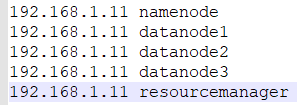

# docker-apache-hadoop

Apache Hadoop 3 dockerisation

# Useful command

## Build the image manually

You can launch the build directly from a git branch

`docker build -t jsminet/docker-apache-hadoop:3.3.3 .`

---

## Launching with docker compose

Build is automatic at first launch with _docker-compose_

`docker-compose up --remove-orphans`

Check **app\traefik\conf\traefik.yml** to deactivate swarm

### Undeploy and clean

`docker-compose down`

`docker-compose rm`

### TODO:

1. Hacer xd
1. Compilar InvertedIndex
1. Hacer PageRank
1. Buscar Datos
1. Aumentar la version del debian/ubuntu?

---

<!-- ## Launching with docker swarm

Swarm mode is enabled by default

`docker stack deploy -c <(docker-compose config) stack-name`

Warning: the 'build' tag is not recognize using **docker deploy**, you have to build it first manually

## Launching with docker swarm and traefik

`docker stack deploy -c <(docker-compose -f docker-compose-traefik.yml config) stack-name`

Warning: If you use Traefik, you have to set the DNS name at client level (e.g: your Windows hosts file C:\Windows\System32\drivers\etc\hosts) according to the name in the .env file

- NAMENODE_DNS=namenode
- DATANODE1_DNS=datanode1
- DATANODE2_DNS=datanode2
- DATANODE3_DNS=datanode3

The hosts file shoud be like this using the swarm master IP

### Undeploy and clean

`docker stack rm stack-name` -->
